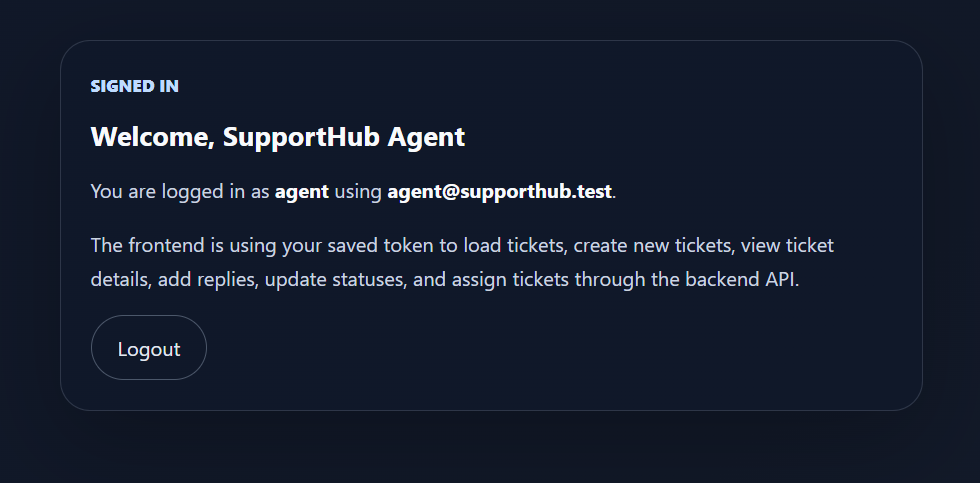
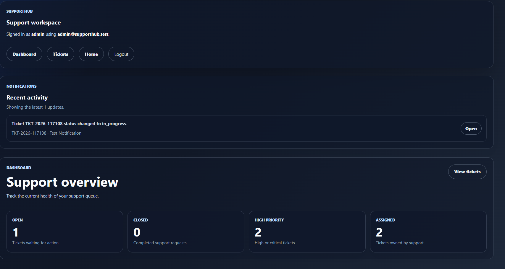
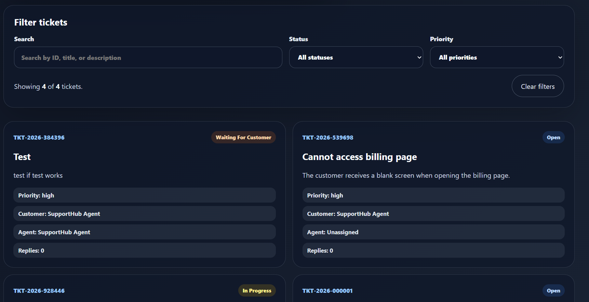
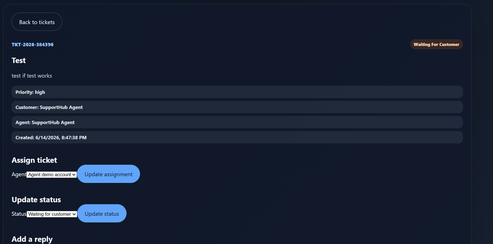
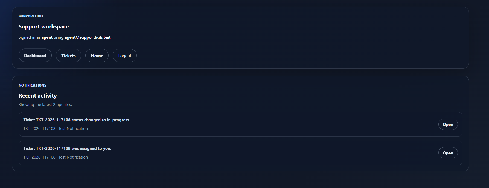
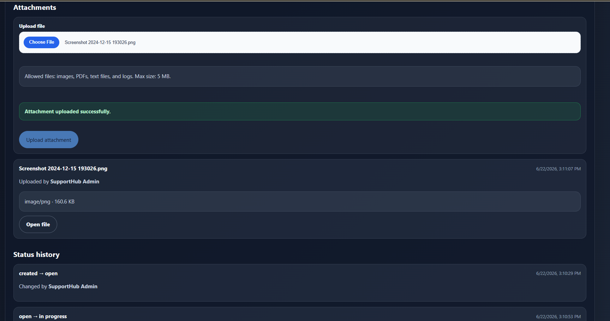

# SupportHub


SupportHub is a full-stack customer support ticketing app built as a portfolio project for technical support, application support, solutions engineering, and full-stack web development roles.

The project models a realistic support workflow where customers create tickets, agents respond to issues, tickets move through statuses, support teams assign ownership, dashboard metrics track support activity, recent notifications surface ticket events, and users can upload file attachments to support conversations.

## Demo Workflow

SupportHub currently supports a working end-to-end support flow:

* Login with seeded demo users
* Navigate through separate React Router pages
* View support dashboard metrics
* List tickets from the Laravel API
* Create new tickets from the React frontend
* View ticket details on a dedicated ticket detail page
* Add ticket replies
* Update ticket status
* Assign tickets to real backend agents
* Filter tickets by search, status, and priority
* Sort tickets by newest, oldest, highest priority, or lowest priority
* Paginate ticket results
* Track ticket status history on the backend and display it in the frontend
* View recent in-app ticket notifications
* Upload and view ticket file attachments

## Frontend Routes

The React frontend uses routed pages instead of keeping the full app on one screen:

| Route                | Description                                                                                                                        |
| -------------------- | ---------------------------------------------------------------------------------------------------------------------------------- |
| `/login`             | Landing page, demo login, backend status, users                                                                                    |
| `/dashboard`         | Support dashboard with ticket metrics                                                                                              |
| `/tickets`           | Ticket list, filters, sorting, pagination                                                                                          |
| `/tickets/:ticketId` | Dedicated ticket detail workspace with replies, assignment, status updates, status history, notifications context, and attachments |

Authenticated pages use a shared app layout with navigation, logout controls, and a recent notifications panel.

## Screenshots

### Login Screen

Path:

```txt
docs/screenshots/login.png
```



### Dashboard

Path:

```txt
docs/screenshots/dashboard.png
```



### Ticket List

Path:

```txt
docs/screenshots/tickets.png
```



### Ticket Detail

Path:

```txt
docs/screenshots/ticket-detail.png
```



### Notifications

Path:

```txt
docs/screenshots/notifications.png
```



### File Attachments

Path:

```txt
docs/screenshots/attachments.png
```



## Tech Stack

### Backend

* Laravel 12
* PHP 8.4
* MySQL 8
* Laravel Sanctum
* PHPUnit / Laravel Feature Tests
* GitHub Actions CI
* REST JSON API
* Laravel API Resources
* Laravel Storage for file uploads

### Frontend

* React
* React Router
* TypeScript
* Vite
* CSS
* Typed API clients
* FormData file uploads

## Current Features

* Customer registration and login
* Token-based API authentication
* Role-based users: customer, agent, admin
* React Router page navigation
* Shared authenticated frontend layout
* Dashboard metrics
* Ticket creation
* Ticket listing
* Ticket detail view
* Ticket replies
* Ticket status updates
* Ticket assignment to agents
* Dynamic agent listing for assignment
* Ticket status history tracking
* Ticket status history display in the frontend
* Server-side ticket filtering
* Server-side ticket sorting
* Paginated ticket API responses
* Simulated in-app notifications
* Notification creation for ticket assignment, status changes, and public replies
* Recent notifications panel in the authenticated layout
* Ticket file attachments
* File upload validation
* Public file links through Laravel storage
* API resources for consistent JSON responses
* React frontend connected to the Laravel API
* Automated backend test suite
* GitHub Actions workflow for backend tests

## Backend API Endpoints

| Method | Endpoint                            | Description                                                |
| ------ | ----------------------------------- | ---------------------------------------------------------- |
| GET    | `/api/health`                       | API health check                                           |
| POST   | `/api/register`                     | Register a customer                                        |
| POST   | `/api/login`                        | Login and receive an API token                             |
| GET    | `/api/me`                           | Get authenticated user                                     |
| POST   | `/api/logout`                       | Logout and revoke current token                            |
| GET    | `/api/dashboard/stats`              | Get dashboard ticket metrics                               |
| GET    | `/api/agents`                       | List assignable agents for admins and agents               |
| GET    | `/api/notifications`                | List recent authenticated user notifications               |
| GET    | `/api/tickets`                      | List tickets with filtering, sorting, pagination           |
| POST   | `/api/tickets`                      | Create a ticket                                            |
| GET    | `/api/tickets/{ticket}`             | View ticket details with replies, attachments, and history |
| POST   | `/api/tickets/{ticket}/replies`     | Add a ticket reply                                         |
| POST   | `/api/tickets/{ticket}/attachments` | Upload a ticket attachment                                 |
| PATCH  | `/api/tickets/{ticket}/status`      | Update ticket status                                       |
| PATCH  | `/api/tickets/{ticket}/assign`      | Assign ticket to an agent                                  |

## Ticket Query Parameters

The ticket list endpoint supports server-side filtering, sorting, and pagination.

```txt
GET /api/tickets?search=billing
GET /api/tickets?status=open
GET /api/tickets?priority=critical
GET /api/tickets?sort=newest
GET /api/tickets?sort=oldest
GET /api/tickets?sort=priority_high
GET /api/tickets?sort=priority_low
GET /api/tickets?page=2
```

Parameters can be combined:

```txt
GET /api/tickets?search=billing&status=open&priority=high&sort=priority_high&page=1
```

## Dashboard

The dashboard provides a quick overview of ticket activity.

Dashboard metrics include:

* Total tickets
* Open tickets
* In-progress tickets
* Waiting-for-customer tickets
* Resolved tickets
* Closed tickets
* High-priority tickets
* Critical-priority tickets

Role-based behavior:

* Customers only see metrics for their own tickets.
* Agents and admins can see broader support metrics.

## Simulated Notifications

SupportHub includes a simulated in-app notifications system.

Notifications are created when:

* A ticket is assigned to an agent
* A ticket status changes
* A public reply is added to a ticket

The authenticated UI displays recent notifications in the shared layout. The notifications panel shows recent ticket activity and links users directly to the related ticket.

## File Attachments

SupportHub supports ticket file attachments.

Users can upload files from the ticket detail page. Attachments are displayed with:

* Original file name
* MIME type
* File size
* Upload date
* Uploader name
* Public open/download link

Allowed file types include:

* Images: `jpg`, `jpeg`, `png`, `gif`, `webp`
* Documents: `pdf`
* Text/log files: `txt`, `log`

Maximum upload size:

```txt
5 MB
```

Authorization rules:

* Customers can upload attachments only to their own tickets.
* Agents and admins can upload attachments to tickets they can access.
* Attachments are included in the ticket detail API response.

## Demo Users

The database seeder creates these demo users:

| Role     | Email                      | Password   |
| -------- | -------------------------- | ---------- |
| Admin    | `admin@supporthub.test`    | `password` |
| Agent    | `agent@supporthub.test`    | `password` |
| Customer | `customer@supporthub.test` | `password` |

If demo users stop working after running tests, seed the database again:

```cmd
cd C:\Users\Zani\supporthub\backend
php artisan db:seed
```

## Local Setup

Clone the repository:

```bash
git clone https://github.com/Panajotc/Supporthub.git
cd Supporthub
```

## Backend Setup

Install backend dependencies:

```bash
cd backend
composer install
```

Create the environment file:

```bash
cp .env.example .env
```

On Windows Command Prompt, use:

```cmd
copy .env.example .env
```

Generate the Laravel app key:

```bash
php artisan key:generate
```

Configure your database in `backend/.env`:

```env
DB_CONNECTION=mysql
DB_HOST=127.0.0.1
DB_PORT=3306
DB_DATABASE=supporthub
DB_USERNAME=root
DB_PASSWORD=
```

Run migrations and seed demo data:

```bash
php artisan migrate:fresh --seed
```

Create the public storage link for uploaded attachments:

```bash
php artisan storage:link
```

Start the API server:

```bash
php artisan serve --host=127.0.0.1 --port=8080 --no-reload
```

The API will be available at:

```txt
http://127.0.0.1:8080/api
```

## Frontend Setup

In a second terminal, install frontend dependencies:

```bash
cd frontend
npm install
```

Create the frontend environment file:

```bash
cp .env.example .env
```

On Windows Command Prompt, use:

```cmd
copy .env.example .env
```

The frontend `.env` file should contain:

```env
VITE_API_BASE_URL=http://127.0.0.1:8080/api
```

Start the React development server:

```bash
npm run dev
```

The frontend will run at the Vite development URL shown in the terminal, usually:

```txt
http://localhost:5173
```

## Running Tests

Run the backend test suite:

```bash
cd backend
php artisan test
```

Current test coverage includes:

* Authentication API
* Agent listing API
* Dashboard stats API
* Customer-specific dashboard stats
* Ticket listing
* Ticket filtering
* Ticket sorting
* Ticket creation
* Ticket detail view
* Ticket replies
* Ticket status updates
* Ticket status history API response
* Ticket assignment
* Notification listing
* Notification creation for ticket assignments
* Notification creation for status changes
* Notification creation for public replies
* Attachment uploads
* Attachment authorization rules
* Attachment visibility in ticket detail
* Role-based access restrictions

Current backend test suite:

```txt
39 tests passing
151 assertions
```

## Building the Frontend

Run the frontend production build:

```bash
cd frontend
npm run build
```

## Continuous Integration

This project uses GitHub Actions to run backend tests automatically on pushes and pull requests to `main` and `develop`.

Workflow file:

```txt
.github/workflows/backend-tests.yml
```

## Project Status

SupportHub is an active full-stack MVP with a working Laravel backend and React frontend.

The current version demonstrates a real-world support workflow with authentication, authorization, routed frontend pages, ticket management, replies, status updates, dynamic assignment, status history, dashboard metrics, in-app notifications, file attachments, server-side filtering, server-side sorting, pagination, backend testing, and CI.

## Portfolio Purpose

This project is designed to demonstrate practical engineering skills:

* Building REST APIs
* Designing relational data models
* Implementing authentication and authorization
* Working with role-based support workflows
* Connecting a React frontend to a Laravel API
* Managing frontend state with TypeScript
* Building routed React pages
* Implementing dashboard metrics
* Implementing simulated notifications
* Implementing file uploads with validation and storage
* Implementing server-side filtering, sorting, and pagination
* Writing automated feature tests
* Using Git and GitHub branch workflows
* Running tests in CI
* Documenting a project clearly
